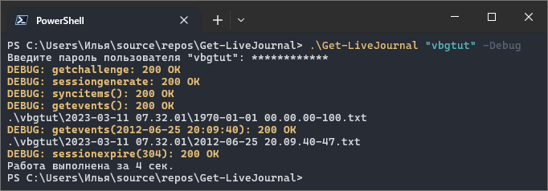
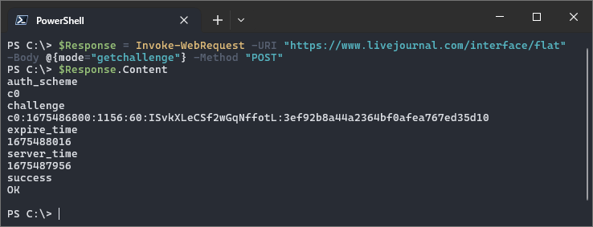
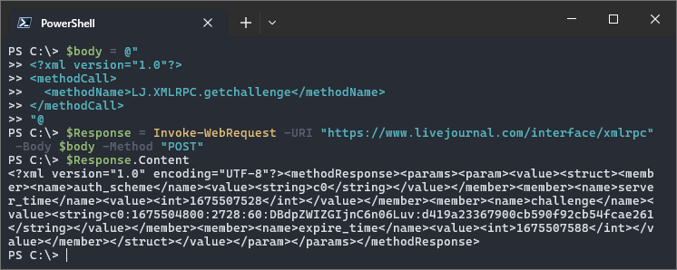

# powershell-livejournal
Общение с «[LiveJournal.com](https://www.livejournal.com/about/)» (сокращенно «LJ»; по-русски «Живой Журнал», сокращенно «ЖЖ») по сети из PowerShell. Я пишу [статьи по этой теме](https://ilyachalov.livejournal.com/316277.html) в своем блоге. Здесь собираюсь хранить скрипты, фрагменты кода (сниппеты) и полезные ссылки для работы с «LiveJournal.com» по сети из командной строки в программе-оболочке «PowerShell».

## Скрипты

Пока что в папке «[scripts](scripts/)» есть только один скрипт, который называется «[Get-LiveJournal](scripts/get-livejournal.ps1)». С его помощью можно загрузить все посты указанного в первом параметре журнала к себе на компьютер. Этот скрипт лишь сохраняет тела HTTP(S)-ответов программы-сервера ЖЖ с постами журнала в текстовые файлы в «сыром» виде (то есть в том виде, в котором их возвращает ЖЖ). Иллюстрация работы скрипта:

_Программа-оболочка «PowerShell» версии 7.3.3, программа-«эмулятор терминала» «Windows Terminal» версии 1.17._

Хоть полученные файлы являются текстовыми, их содержимое неудобно просматривать, так как ЖЖ возвращает данные постов в разбитом на множество параметров виде. Для дальнейшей работы с постами нужно создать скрипт, который преобразует полученные данные в какой-нибудь читабельный формат, например в XML или в HTML или в еще какой-либо вид. Еще можно создать отдельный скрипт, который загрузит полученные данные на какой-либо другой веб-сервис ведения блогов или сайт, например на «[WordPress.com](https://wordpress.com)» и т.п.

## Фрагменты кода (сниппеты)

- [snippets-flat.md](snippets-flat.md) (для работы через [интерфейс «flat»](https://stat.livejournal.com/doc/server/ljp.csp.flat.protocol.html));
- [snippets-xmlrpc.md](snippets-xmlrpc.md) (для работы через [интерфейс «XML-RPC»](https://stat.livejournal.com/doc/server/ljp.csp.xml-rpc.protocol.html)).

Я работаю в операционной системе «Windows 10». Использую программу-оболочку «[PowerShell](https://github.com/PowerShell/PowerShell)» версии 7 и программу-«эмулятор терминала» «[Windows Terminal](https://github.com/Microsoft/Terminal)» версии 1.17.

Из программы-оболочки «PowerShell» удобно пользоваться классами платформы «[.NET](https://learn.microsoft.com/en-us/dotnet/)», я часто использую эту возможность в сниппетах.

В папке «[xml-examples](xml-examples/)» я собираюсь хранить примеры тел HTTP(S)-ответов в формате XML-RPC. Эти файлы неудобно полностью вставлять в пост, так как они занимают много места, но я буду оставлять в постах в своем блоге ссылки на эти файлы, чтобы читатель мог получить представление о том, как выглядит ответ в формате XML-RPC.

## Полезные ссылки

- [документация протокола общения](https://stat.livejournal.com/doc/server/ljp.csp.protocol.html) с «LiveJournal.com»;
- [правила](https://www.livejournal.com/bots/) «LiveJournal.com» для роботов;
- [пользовательское соглашение](https://www.livejournal.com/legal/tos-ru.bml) «LiveJournal.com» (обратить внимание на **пункт 9.2.6**);
- [спецификация](http://xmlrpc.com/spec.md) протокола XML-RPC;
- [документация](https://learn.microsoft.com/en-us/powershell/module/microsoft.powershell.utility/invoke-webrequest) командлета `Invoke-WebRequest`.

Статьи:

- [PowerShell и LiveJournal (ЖЖ): три способа аутентификации](https://habr.com/ru/post/717914/)&nbsp;— моя статья на «Хабре» от 20 фев.2023&nbsp;г.;
- [Основы работы с сервером livejournal.com](https://jenyay.net/Programming/LJServer)&nbsp;— статья Евгения Ильина от 14 окт.2007&nbsp;г.;
- [PowerShell и LiveJournal (ЖЖ): скачивание постов журнала](https://habr.com/ru/post/724412/)&nbsp;— моя статья на «Хабре» от 23 мар.2023&nbsp;г.
